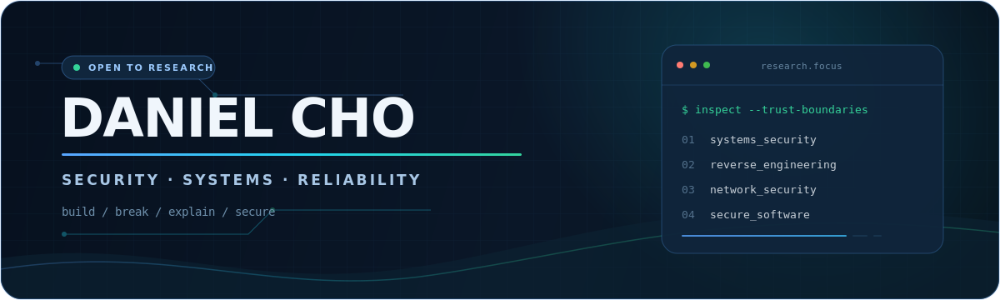

  

  <strong>Kyung Hee University · Computer Science & Engineering (2022)</strong> 
  WhiteHat School 4th · Seoul, Korea

  <a href="mailto:chominkyu3290@gmail.com">Research contact</a>
  ·
  <a href="https://github.com/danielcho02?tab=repositories">Repositories</a>
  ·
  <a href="https://github.com/danielcho02/phone2pad/releases">Releases</a>

---

## Security, from behavior to evidence

I am an undergraduate developer moving toward **systems and security research**. I am most interested in the point where ordinary software behavior becomes a security boundary: binary formats, protocols, authentication, untrusted input, and failure handling.

> **Working principle:** build the system, locate its trust boundaries, reproduce the failure, and make the fix testable.

| Research direction | What I am exploring |
| --- | --- |
| **Systems security** | Binary exploitation, reverse engineering, memory corruption, and OS isolation |
| **Network & embedded security** | Protocol parsing, traffic analysis, router firmware, and constrained devices |
| **Secure software design** | Threat modeling, authentication, defensive parsing, and reproducible security tests |
| **Trustworthy evaluation** | External validation, failure analysis, and evidence that survives distribution shift |

> **Open to:** undergraduate research opportunities in systems security, binary analysis, network/embedded security, and trustworthy software.

---

## Selected engineering & research

<table>
<tr>
<td width="50%" valign="top">

### 01 · [phone2pad](https://github.com/danielcho02/phone2pad)

**Cross-platform systems engineering with explicit trust boundaries**

Built an Android-to-Windows input pipeline over local USB/ADB using a custom binary protocol. The released path requires no account, cloud service, analytics, or administrator privileges.

The in-development Wi-Fi path adds explicit pairing, mutual authentication, HKDF-derived session keys, AES-GCM records, replay counters, and bounded parsers using platform cryptography APIs.

`C++` `Kotlin` `Win32` `Android` `Protocol Design`

[Architecture](https://github.com/danielcho02/phone2pad/blob/main/docs/01-ARCHITECTURE.md) · [Wi-Fi security design](https://github.com/danielcho02/phone2pad/blob/main/docs/07-WIFI-TRANSPORT.md) · [v0.3.0](https://github.com/danielcho02/phone2pad/releases/tag/v0.3.0)

</td>
<td width="50%" valign="top">

### 02 · [CVE-2023-4863 Reproduction](https://github.com/gunh0/kr-vulhub/pull/371)

**Differential vulnerability reproduction — open upstream PR**

Built a Dockerized AddressSanitizer lab that runs the same deterministic WebP input against libwebp **1.3.1** and patched **1.3.2**.

The contribution includes a PoC generator, C decoder harness, checksum-pinned sources, and fail-closed verification. It reproduces the documented heap-buffer-overflow in isolation; it does **not** claim browser exploitation, RCE, or sandbox escape.

`C` `Python` `Docker` `AddressSanitizer` `Patch Comparison`

[Open PR #371](https://github.com/gunh0/kr-vulhub/pull/371) · [Reproduction lab](https://github.com/danielcho02/kr-vulhub/tree/d1ab3b3ddfbf3afa3ea74886d94d1152da9939a1/Libwebp/CVE-2023-4863) · [Verification script](https://github.com/danielcho02/kr-vulhub/blob/d1ab3b3ddfbf3afa3ea74886d94d1152da9939a1/Libwebp/CVE-2023-4863/scripts/verify.sh)

</td>
</tr>
<tr>
<td width="50%" valign="top">

### 03 · [PCAP TCP Sniffer](https://github.com/danielcho02/whs_pcap_proj)

**Small C parser, security-minded boundary checks**

Implemented live capture and direct parsing of Ethernet, IPv4, TCP, and payload data with `libpcap`.

The parser checks captured length, IP total length, IHL, TCP data offset, link-layer type, and payload bounds before reading packet fields—treating every packet as untrusted input.

`C` `libpcap` `TCP/IP` `BPF` `Linux`

[Source](https://github.com/danielcho02/whs_pcap_proj/blob/main/pcap_tcp_sniffer.c) · [Implementation notes](https://github.com/danielcho02/whs_pcap_proj/blob/main/docs/implementation-notes.md) · [Report](https://github.com/danielcho02/whs_pcap_proj/blob/main/report.md)

</td>
<td width="50%" valign="top">

### 04 · [Secure Coding Practice](https://github.com/danielcho02/whs_secure_coding_proj/tree/main)

**Threat models connected to patches and regression evidence**

A DevSecOps practice project—not a production service—that maps BOLA/IDOR, unsafe uploads, price tampering, authorization, session, webhook, and race-condition risks to server-side policies and tests.

The latest `main` evidence records **381 unit tests** and **14 Docker integration tests** passing, while explicitly preserving unverified browser E2E work as a stated limitation.

`TypeScript` `NestJS` `Prisma` `Redis` `Security Testing`

[Security report](https://github.com/danielcho02/whs_secure_coding_proj/tree/main/docs/security-report) · [QA evidence](https://github.com/danielcho02/whs_secure_coding_proj/blob/main/docs/security-report/evidence/test-results.md) · [Residual risks](https://github.com/danielcho02/whs_secure_coding_proj/blob/main/docs/security-report/14-residual-risks.md)

</td>
</tr>
</table>

**Research practice:** In the team project [Pneumonia Domain Shift](https://github.com/danielcho02/pneumonia_domain_shift), I handled Kaggle/RSNA data preparation, DICOM metadata EDA, patient-ID-aware splitting, Albumentations, and baseline CNN training. The team studied fixed-threshold external validation, bootstrap confidence intervals, and Grad-CAM. [Role definition →](https://github.com/danielcho02/pneumonia_domain_shift/blob/main/docs/proposal.md#12-%EC%97%AD%ED%95%A0-%EB%B6%84%EB%8B%B4)

**Engineering breadth:** [yeON](https://github.com/danielcho02/yeON) is a full-stack planning workflow built with Next.js and Prisma, including role-aware flows, explicit state transitions, and an extensive migration history.

---

## Working toolkit

| Layer | Tools I use |
| --- | --- |
| **Languages** | C, C++, Python, TypeScript, Kotlin, PowerShell |
| **Security study** | GDB/pwndbg, IDA, Frida, Wireshark, Burp Suite, pwntools |
| **Systems** | Linux, Win32, Android, Docker, CMake, ADB |
| **Research** | PyTorch, scikit-learn, OpenCV, Slurm |

I am currently deepening my work in **binary exploitation**, **reverse engineering**, **firmware analysis**, and **reproducible vulnerability research**.

---

## Responsible security practice

I reproduce vulnerabilities only in isolated environments and on systems I am authorized to test. Public write-ups separate observed evidence from unverified impact, compare vulnerable and patched baselines, and document limitations alongside results.

---

## Contact

If your lab or team works on systems security, program analysis, reverse engineering, network/embedded security, or secure software design, I would be glad to discuss how I can contribute.

**Daniel Cho (조민규)** · Seoul, Korea · [chominkyu3290@gmail.com](mailto:chominkyu3290@gmail.com)

  <code>build</code> → <code>break</code> → <code>explain</code> → <code>secure</code>

